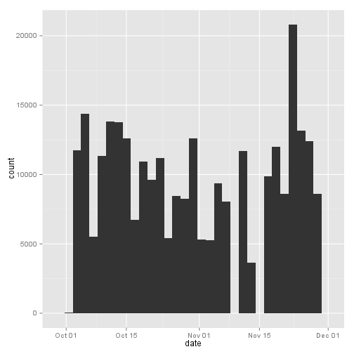
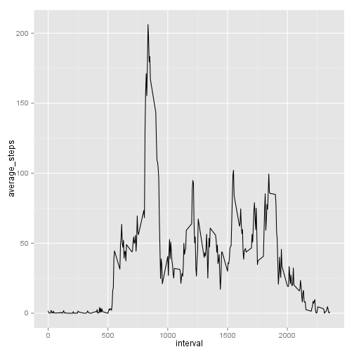
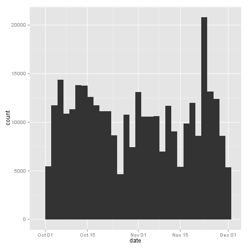
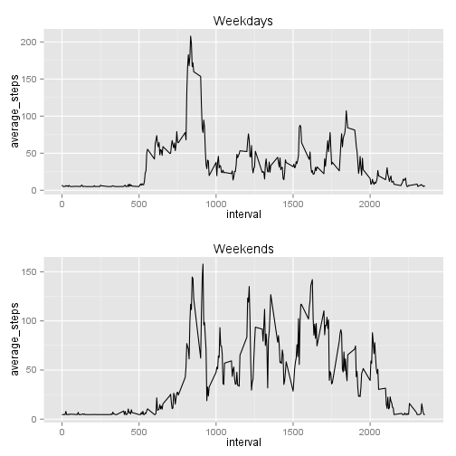

## Loading and preprocessing the data
Reading data from the file in the working directory.

```r
data <- read.csv("activity.csv", header=TRUE, stringsAsFactors=FALSE)
completeData <- data[!is.na(data[,"steps"]),]
```


## What is mean total number of steps taken per day?
Plotting a histogram for the number of steps per day.

```r
library(dplyr)
stepsSumPerDay <- completeData %>% group_by(date) %>% summarise(steps = sum(steps))
library(lubridate)
stepsSumPerDay$date <- ymd(stepsSumPerDay$date)
library(ggplot2)
qplot(date, data=stepsSumPerDay, weight=steps/2, geom="histogram")
```

```
## stat_bin: binwidth defaulted to range/30. Use 'binwidth = x' to adjust this.
```

 

Calculating the mean and median of total steps taken per day

```r
mean(stepsSumPerDay$steps)
```

```
## [1] 10766.19
```

```r
median(stepsSumPerDay$steps)
```

```
## [1] 10765
```

## What is the average daily activity pattern?
Drawing a plot for average daily activity.

```r
dailyPattern <- completeData %>% group_by(interval) %>% summarize(average_steps=mean(steps))
ggplot(dailyPattern, aes(x = interval, y = average_steps)) + geom_line()
```

 

Finding the interval with highest activity across all days.

```r
dailyPattern[dailyPattern$average_steps == max(dailyPattern$average_steps),"interval"]
```

```
## Source: local data frame [1 x 1]
## 
##   interval
## 1      835
```
## Imputing missing values
Calculating total number of missing values.

```r
sum(is.na(data$steps))
```

```
## [1] 2304
```

Replacing NAs with mean number of steps per interval.

```r
replacedData <- data
replacedData[is.na(data),"steps"] <- mean(dailyPattern$average_steps)
```

Plotting new histogram without missing data.

```r
replacedStepsSumPerDay <- replacedData %>% group_by(date) %>% summarise(steps = sum(steps))
replacedStepsSumPerDay$date <- ymd(replacedStepsSumPerDay$date)
qplot(date, data=replacedStepsSumPerDay, weight=steps/2, geom="histogram")
```

```
## stat_bin: binwidth defaulted to range/30. Use 'binwidth = x' to adjust this.
```

 

Calculating the mean and median for the new data.

```r
mean(replacedStepsSumPerDay$steps)
```

```
## [1] 10766.19
```

```r
median(replacedStepsSumPerDay$steps)
```

```
## [1] 10766.19
```

Filling in the missing values fills in the missing spots on X axis of the histogram.
## Are there differences in activity patterns between weekdays and weekends?
Dividing data into two sets based on weektime and comparing the plots of activity during weekends and weekdays.

```r
replacedData$date <- ymd(replacedData$date)
weeklyData <- replacedData %>% mutate(weektime = ifelse(weekdays(date)=="Sunday" | weekdays(date)=="Saturday", "weekend", "weekday"))
weekends <- weeklyData %>% filter(weektime == "weekend") %>% group_by(interval) %>% summarize(average_steps=mean(steps))
weekdays <- weeklyData %>% filter(weektime == "weekday") %>% group_by(interval) %>% summarize(average_steps=mean(steps))

weekdaysPlot <- ggplot(weekdays, aes(x = interval, y = average_steps)) + geom_line() + ggtitle("Weekdays")
weekendsPlot <- ggplot(weekends, aes(x = interval, y = average_steps)) + geom_line() + ggtitle("Weekends")

library(grid)
pushViewport(viewport(layout = grid.layout(2, 1)))
print(weekdaysPlot, vp = viewport(layout.pos.row = 1, layout.pos.col = 1))
print(weekendsPlot, vp = viewport(layout.pos.row = 2, layout.pos.col = 1))
```

 
